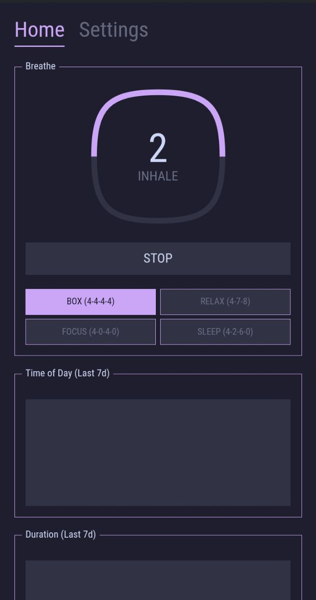

# Kisoku 気息

  

## Overview

A breathing exercise app to calm the mind. Inspired by the system-24 theme aesthetic

## Screenshots

  
 

## Features

- 4 breathing exercises like box breathing, 4260 breathing.
- **Retro terminalesque design:** Inspired by Unix customizations found online.
- Use unix like commands to set or remove notes tabs.
- **Lightweight:** Consumes only 0.05% CPU and 68KB of RAM. After all, simple apps shouldn't need more—remember, the Apollo mission operated on a computer with around 4KB of RAM!
- **Highly customizable:** Offers many themes with plans to add more customizations such as fonts, font sizes, and border colors.

## No Cloud Integration

This app is designed to operate entirely locally, with no cloud storage involved. The app doesn't asks for internet permissions and cannot connect to the internet. Further updates won't add internet permissions either, by design.

## Releases

- You can download the latest apk from github releases section here: [Releases](https://github.com/ronynn/karui/releases)

- Stay updated via our [RSS feed for GitHub releases](https://github.com/ronynn/kisoku/releases.atom) which includes detailed release notes.

## Licenses
Karui is being developed under the GPLv3 License.

## Follow the Development

Join us (my thought process and approach with other's opinions) on telegram: <https://t.me/karuifoss>
This app has been primarily made on my phone with Acode editor with alpine linux terminal.

Github Issues are the fastest way to get in touch, for other means there's gitlab, bluesky, and my dev.to account, all linked in my account page on github and [homepage](https://ronynn.github.io).

If you like the app, don't forget to leave a star ⭐ here on github and let me know your suggestions!
